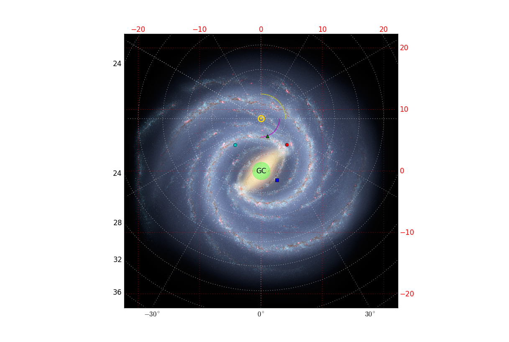

Tools for making face-on views of the Galaxy
============================================

This is a toolkit for making face-on views of the galaxy, including
superpositions on Robert Hurt's famous illustration of the Galaxy.

.. image:: https://d2weczhvl823v0.cloudfront.net/keflavich/milkywayplots/trend.png
   :alt: Bitdeli badge
   :target: https://bitdeli.com/free

